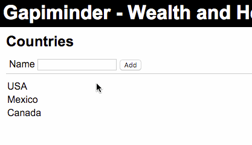

# Instructions

For this assignment you have to create a page according with the video.

The page should look like the following image, and allow the user to add new countries to the list.

**Goal: **The user should be able to type the country name in the text box and, after clicking on add the system should include the country in the country list. Failing to meet this goal will result in a **\*FAIL*** grade.

=> SUBMIT one single HTML file named **lastname_firstname_1.html**

All your code (HTML, CSS and Javascript) should be within this single file. 

### Done by a normal way and React.js

